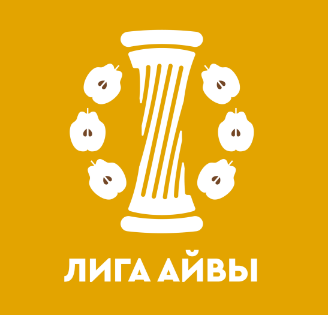

[На главную](./)

# Эпизод 8

<dl>
<dt>Собеседник</dt>
<dd>Ольга Маркелова</dd>
<dt>Специальность</dt>
<dd>кандидат филологических наук</dd>
<dt>Университеты</dt>
<dd>Университет Исландии, Университет Фарерских островов</dd>
<dt>Дата</dt>
<dd>23 июля 2024</dd>
<dt>Ссылки на аудио</dt>
<dd><a href="https://universitates.mave.digital/ep-9">Mave</a>, <a href="https://youtu.be/1sgb-SbUnWY">YouTube</a>, <a href="https://vk.com/video-223898464_456239027">VK</a>, <a href="">Apple Podcasts</a>, <a href="">Яндекс.Музыка</a></dd>
</dl>

## Анонс

Ольга Маркелова об университетах Исландии и Фарёр, о возрасте студентов в скандинавских странах и овцах под окнами учебного корпуса.

## Транскрипт

Участники: Ольга Маркелова, Борис Орехов

\[00:00:08.840\] — Борис Орехов

Сегодня мы беседуем с Ольгой Александровной Маркеловой, кандидатом филологический наук и скандинавистом. И говорить мы будем про как раз северогерманские, скандинавские университеты, не материковые. Мы немножко уже затронули вопрос того, как устроен университет в Германии, но сегодня мы перемещаемся севернее или даже северо-западнее в совершенно романтические, прекрасно выглядящие места. Ольга Александровна, какие у вас были впечатления от Исландского университета по сравнению с российским, когда вы туда попали?

\[00:00:40.906\] — Ольга Маркелова

Добрый день, я рад всех приветствовать. Прежде всего, надо сказать, что попала я туда по нынешним меркам довольно давно. Сперва в 2001 году на краткосрочную стажировку, а потом уже в 2002 на полный курс бакалавриата. И тогда отличий между университетами западными и российскими было все-таки гораздо больше, чем сейчас. Конечно, сам возраст студентов: у нас в университет идут сразу после школы. Если не поступил, то это считается ужасным провалом в жизни. В университеты в скандинавских странах приходят уже люди более зрелые. Иногда туда приходят люди, которые наконец-то дорвались до возможности не работать за благо общества и семьи и получить гуманитарное образование на каком-нибудь филологическом факультете. Поэтому студенты там более самостоятельные, их никто, грубо говоря, не водит за ручку, и многое они должны выяснять сами и сами нести ответственность. Вплоть до того, что свой учебный план студент составляет сам, просто следя, чтобы набрать нужное количество баллов, на которое оцениваются предметы. Конечно, мне надо было быть морально готовой, что преподавание будет на исландском. Не все преподаватели делают скидку на то, что на их курсе может сидеть иностранец, которому не все понятно. Хотя, помню, на одном экзамене мне разрешили пользоваться словарями. Но сообщили мне об этом, когда я уже выехала на экзамен и вернуться за словарем было нельзя. Пожалуй, что было еще непривычно, многие экзамены были письменными. А если экзамен был устный, то полагалось, чтобы его принимал не только преподаватель, который вел курс у своих студентов, но и сидел так называемый цензор. Вот, пожалуй, что можно сказать об учебном процессе. Естественно, много времени приходилось проводить в библиотеках. В Исландии замечательная библиотека Landsbókasafn — центральная библиотека страны, куда есть доступ и простым читателям, и студентам университета. 

Если какие-то книги нужны для какого-то университетского курса, то они резервировались на отдельную полочку. Это значит, что для простых читателей они уже были недоступны. Отношения между студентами и преподавателями дружественные. Собственно, в Исландии дружественные отношения между людьми с разными статусами считаются нормой. Нарочно никто дистанции не держит. Помню, для моих русских сокурсников было культурным шоком, что на перекуре преподаватель может попросить у студента сигаретку, а в Исландии это совершенно нормально.

\[00:02:59.361\] — Борис Орехов

Еще в [известной лекции Стеблин-Каменского о трех скандинавских столицах](https://danefae.org/djvu/hovedsteder.htm) сказано, что исландские студенты должны называть своего преподавателя на «ты», потому что если они называют его на «вы», то считается, что они не знают, что это их преподаватель, а что считают, что это какой-нибудь прохожий просто.

\[00:03:16.592\] — Ольга Маркелова

«Ты» и «вы» в исландском языке это, в принципе, тонкий нюанс. В принципе, вообще ко всем принято обращаться на «ты». Местоимение «вы» в языке, можно сказать, устаревшее. Если кто-то кого-то называет на «вы», это значит, что он нарочно пытается создать дистанцию, а создавать дистанцию между людьми – это невежливо. И преподавателей действительно называют на «ты» и по имени.

\[00:03:36.926\] — Борис Орехов

А вот этот момент, связанный с библиотекой, мне кажется, очень интересным. Получается, что Исландский университет как бы теснее встроен в пространство города, чем мы привыкли, например. Потому что в России ты точно знаешь, где граница университетского пространства, что ты в какой-то момент его пересекаешь, оказываешься либо в окружающем городе, либо внутри университетского кампуса. А я в Рейкьявике однажды как раз оказался в кафе университетском и понял, что я не понимаю, где проходит эта граница. Когда я внутри университета нахожусь, а когда я уже вышел во внеуниверситетское городское пространство. И, видимо, это такая некоторая особенность, которая для нас непривычна.

\[00:04:19.766\] — Ольга Маркелова

Строго говоря, в университете нет пропускной системы, вокруг территории нет забора. То есть, собственно говоря, в любой корпус может пройти каждый, даже не являющийся студентом или сотрудником.

\[00:04:31.930\] — Борис Орехов

А само по себе понятие университета в Исландии отличается от привычного нам? То есть университет – это то же самое или это что-нибудь другое?

\[00:04:42.236\] — Ольга Маркелова

Ну, начнём с самого слова университет. Конечно, в исландском языке с его пуризмом это не латинское заимствование, это исландское слово «háskóli», где «skóli» – это, понятно, школа, учебное заведение. Компонент «há» означает «высокий, высший». Университет – это высшая школа. Там есть «grunnskóli» – школа общеобразовательная, есть «leikskóli» – детский сад, Есть «menntaskóli» — колледж или гимназия, и есть «iðnskóli» — профессионально-техническое училище, и есть «háskóli» — университет. То есть даже уже по лексике видно, насколько университет встроен во всю остальную структуру образования.

\[00:05:18.273\] — Борис Орехов

Ну, то есть это такая более привычная история с тем, что ты получаешь такое образование. Но вы же как раз чуть раньше говорили о том, что это особенность скорее присущая нашим широтам, что вот ты закончил школу, потом пошёл в университет, а в Исландии вроде бы это не совсем так, но если смотреть на эту схему, то получается, что наоборот. Совершенно естественно, что ты заканчиваешь, там, среднее образование и идёшь на ступень высшего.

\[00:05:43.018\] — Ольга Маркелова

Ну, вот, кстати, к вопросу об отсутствии границ, справедливы обамоиутверждения,так как нет такой границы между социальными стратами. Один человек может закончить школу или не закончить, несколько лет провести на море, добывая для страны треску. А потом поступить в университет и выучить, скажем, ряд европейских языков. Исландец никогда не сидит в какой-то одной группе, в одном социальном классе. Он всегда является несколькими человеками. И крестьянином, и ученым, и поэтом, и продавцом в продуктовом магазине. Конечно, это связано с тем, что мало людей, а, с другой стороны, связано с тем, что уважаемым считается любой труд и на море, и в лаборатории.

\[00:06:28.092\] — Борис Орехов

Это немножко напоминает такую бытовую историю из 90-х, когда профессор был вынужден выращивать помидоры на своём огороде для того, чтобы просто прокормить свою семью, выжить, что-нибудь такое. А вот по поводу горизонтальных связей интересно. Начать, наверное, даже нужно не с них, а вот то, что я, помимо университета в Рейкьявике, видел ещё, как устроен университет в Акюрейри, в городе на севере Исландии. 

И, ну, то есть с привычными нам именно университетами, которые включают в себе все возможные специальности, там Trivium, Quadrivium и множество других специальностей, которые уже появились после Средних веков, было видно, что количество факультетов и специальностей там сильно ограничено просто запросом. То есть там не было, скажем, изучения какой-нибудь зарубежной литературы, а было туристическое дело. То есть то, что скорее нам привычно видеть в учреждениях профессионального образования.

\[00:07:21.976\] — Ольга Маркелова

Я боюсь, что это черта времени, когда все гонятся за какой-то практичностью. И действительно пытаются перевести учебное заведение в какую-то практическую плоскость. А туризм сейчас все-таки – это одна из основных отраслей в Исландии, на которой зиждется вся ее экономика.

\[00:07:37.813\] — Борис Орехов

Ну, а правильно ли я понимаю, что, естественно, вы, когда оказались в этой среде, вы общались главным образом с филологами, но были ли у вас представления о том, кто преподает и что преподают на соседних факультетах, скажем, связанных с естественной наукой?

\[00:07:57.699\] — Ольга Маркелова

Начнем с того, что естественные науки были в отдельном корпусе. Но да, действительно, не возбранялось пойти послушать и периодически устраивались всякие лекции. В Исландии замечательно развита геология. И если исландцы ездят за рубеж получать образование по тем специальностям, которых не хватает в Исландии, то изучать геологию в Исландию приезжают даже из Соединённых Штатов. Но, правда, конечно, исландский язык они не учат, поэтому некоторые лекции по геологии читаются на английском.

\[00:08:24.108\] — Борис Орехов

А вот когда я учился в университете, некоторые наши преподаватели, склонные к такой деятельности, организовывали какие-нибудь праздники. Для нас, может быть, это было связано с возрастом, опять-таки, что мы всё-таки были довольно юными, только что окончившими школу, людьми. И вот был у нас там, скажем, День русского языка, или даже не День русского языка, а какие-то праздничные мероприятия, посвященные русскому языку, в День филолога. Что-то ещё мы там праздновали как будто бы вместе, ну так, немножко по-пионерски, но, тем не менее, у нас были какие-то, вот как сейчас говорят, ивенты общие. Такое бывает в исландском обществе, и я прежде всего имею в виду университет, или все-таки это как-то считается чем-то лишним?

\[00:09:11.324\] — Ольга Маркелова

Такие мероприятия бывают, но их организовывает в основном студсовет. На моей памяти были вечеринки, также у университета Исландии своя театральная студия, и в мое время, когда бар под названием «Студенческий подвал» находился еще в подвале общежития, а не в подвале книжного магазина, как сейчас, в нем была концертная площадка, и там часто проходили концерты хороших групп, в частности, там выступала никто иная, как сама Eivør Pálsdóttir, которая сейчас, по-моему, выступает на каких-то только очень помпезных площадках.

\[00:09:41.913\] — Борис Орехов

А правильно ли я понимаю, что поскольку, ну, все-таки и страна маленькая, и население небольшое, то и университет, ну, как бы масштабирован под эти размеры, и, скажем, там не очень много и студентов, и, скажем, сами учебные аудитории тоже не такого объема, как вот мы привыкли видеть поточные аудитории в первом гуманитарном корпусе МГУ?

\[00:10:05.406\] — Ольга Маркелова

А вот, как ни странно, как раз наоборот. Поточные аудитории обыкновенного размера, они не микроскопические, за последние десятилетия, просто как грибы повырастали новые корпуса. Раньше на кампусе главной составляющей был простор, было видно окрестные горы вокруг, а теперь уже окрестных гор не видно из-за этих новых корпусов. Они тянутся к небу, поблёскивая своими большими современными окнами.

\[00:10:31.894\] — Борис Орехов

А студенческое братство есть? То есть, вот, например, вы общаетесь с кем-нибудь из тех, с кем познакомились в университете?

\[00:10:39.495\] — Ольга Маркелова

Как ни странно, чаще я общаюсь со своими бывшими преподавателями по вопросам исландской филологии.

\[00:10:44.536\] — Борис Орехов

Вы же на самом деле не с Исландии начинали, да, насколько я знаю, ваша научная карьера отталкивалась скорее даже от Фарёр?

\[00:10:53.258\] — Ольга Маркелова

Собственно, я от Фарерских островов так и далеко не ушла, и в университете Исландии, кстати говоря, я взяла себе курс по фарерскому языку, пользуясь тем, что туда приехала Turið Sigurðardóttir, крупнейший фарерский литературовед, читать курс лекций о фарерской литературе. И моя диссертация о фарерской литературе написана тоже в годы учебы в университете Исландии. И Фарерские острова были рядом, и можно было всегда ожидать кого-нибудь с них. И наблюдать одновременно две близкородственные культуры было, конечно, очень здорово.

\[00:11:25.172\] — Борис Орехов

Слышали ли вы что-нибудь про Фарерский университет, который существует, который есть?

\[00:11:30.935\] — Ольга Маркелова

Да, я в нем была на летней стажировке, которая, кстати, была от университета Исландии.

\[00:11:36.278\] — Борис Орехов

И впечатления ваши? Поделитесь?

\[00:11:39.080\] — Ольга Маркелова

Впечатления были замечательные. Это был, насколько я помню, 2003 или 2004 год. Фарерский университет действительно маленький. Он влезает в один небольшой двухэтажный домик. Факультетов там мало, потому что чтобы изучать какую-нибудь высшую математику фарерцы могут всегда съездить в Данию. Благо у них все еще есть датское гражданство. А в университете Фарерских островов изучают, собственно, дисциплины, связанные с самими островами. И в первую очередь, конечно, фарерский язык и литературу. В нем есть замечательная библиотека с фарерскими книгами.

\[00:12:10.967\] — Борис Орехов

Но библиотека, наверное, должна... Для нее не выделено отдельное помещение, отдельное, скажем, здание? Неужели все вот в этом двухэтажном здании помещается?

\[00:12:21.250\] — Ольга Маркелова

Ну, вот каким-то образом оно было так удачно спроектировано, что туда помещалось всё.

\[00:12:25.392\] — Борис Орехов

Ну да, наверное, нужно вспомнить о том, что это молодая литература, и книг там, может быть, не столько, сколько у литературы, которая уходит на много веков в прошлое.

\[00:12:35.499\] — Ольга Маркелова

А когда человек выглядывал из окна второго этажа, то он мог увидеть, что, например, на газоне перед зданием университета пасется конь или, там, какая-нибудь овца. В Торсхавне скотину, ну, по крайней мере, в те годы держали.

\[00:12:46.967\] — Борис Орехов

Да, отличная история. То есть ещё в большей степени даже, чем в Рейкьявике, университет встроен в то, что происходит. Но думаю, что все мы видели картинки, фотографии с Фарерских островов. Они, конечно, прежде всего напоминают такое сельское пространство посреди бушующих волн. И я так понимаю, что примерно те же самые экстерьеры мы видим и вокруг университета, который тоже примерно такой же оазис знания посреди вот этой почти первозданной стихии.

\[00:13:21.751\] — Ольга Маркелова

С той разницей, что на Фарерских островах, конечно же, нет ледников и вулканов. А так пейзажи примерно такие же, горные породы те же.

\[00:13:28.965\] — Борис Орехов

Да, отличная история. Спасибо вам большое!

Айдентика Университета Исландии.

-----

[На главную](./)

