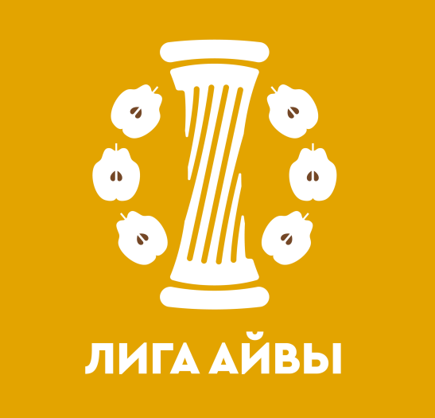

[На главную](./)

# Эпизод 24

<dl>
<dt>Собеседник</dt>
<dd>Ринат Бакиров</dd>
<dt>Специальность</dt>
<dd>кандидат филологических наук</dd>
<dt>Университеты</dt>
<dd>КФУ</dd>
<dt>Дата</dt>
<dd>19 ноября 2024</dd>
<dt>Ссылки на аудио</dt>
<dd><a href="https://universitates.mave.digital/ep-25">Mave</a>, <a href="https://www.youtube.com/watch?v=4RAWnTymXWc">YouTube</a>, <a href="https://vk.ru/podcast-223898464_456239041">VK</a>, <a href="https://podcasts.apple.com/us/podcast/%D1%80%D0%B8%D0%BD%D0%B0%D1%82-%D0%B1%D0%B0%D0%BA%D0%B8%D1%80%D0%BE%D0%B2-%D0%BE-%D0%BA%D0%B0%D0%B7%D0%B0%D0%BD%D1%81%D0%BA%D0%BE%D0%BC-%D1%83%D0%BD%D0%B8%D0%B2%D0%B5%D1%80%D1%81%D0%B8%D1%82%D0%B5%D1%82%D0%B5/id1728738207?i=1000677389829">Apple Podcasts</a>, <a href="https://music.yandex.ru/album/29434531/track/133051979?utm_source=web&utm_medium=copy_link">Яндекс.Музыка</a></dd>
</dl>

## Анонс

Ринат Бакиров о Казанском федеральном университете

Темы:
* Приволжский — зачем это дополнение?
* Памятник Ленину-студенту и «сковородка»
* Архитектура КФУ: от классицизма до капрома
* Казань — третья столица и университет как её символ
* Восточное отделение: гордость или травма?
* Кто вершит судьбу университета: Москва или регион?
* Державин, Лобачевский, Толстой: чьи имена носят корпуса?
* Неофициальные топонимы: «двойка», «сковородка», «лобачевка»
* Университет в кино и литературе
* 220 лет Казанскому университету

## Встроенный плеер

<iframe src="https://player.mave.digital?podcast=universitates&episode=25&color=rgb(245,215,95)&mute=1&date=1&download=1" style="width: 100%" height="235" scrolling="no" frameborder="no"></iframe>

## Транскрипт

*Участники: Ринат Бакиров, Борис Орехов*

[00:02] — Борис Орехов

Лига Айвы — это подкаст об университете как о Республике учёных. Сегодня мы беседуем с кандидатом филологических наук Ринатом Альбертовичем Бакировым.

Пишем мы сегодня в здании Казанского Приволжского федерального университета. Ринат, а зачем это дополнение «Приволжский»? Это вообще кто-то так говорит?

[00:26] — Ринат Бакиров

Добрый день, Борис Валерьевич, добрый день всем слушателям. В этом была довольно большая проблема. В 2010 году, когда Казанский федеральный университет появился как федеральный — приказом, по-моему, тогда ещё Дмитрия Медведева от 2009 года — у нас должен был быть Приволжский федеральный университет. Но студенты, дух XIX века ещё был жив в некоторых, выступили против того, чтобы у нас появился исключительно ПФУ. И как вы видите, в названии, в отличие от других федеральных университетов, у нас сохранён Казанский.

«Приволжский» осталось, но на самом деле оно практически не используется — в официальных бумагах, может быть, в речи иногородних или чиновных лиц. А мы сами даже в аббревиатуру не всегда добавляем это «п» в скобках, ограничиваемся КФУ. А кто-то ограничивается вообще «Казанским университетом». Это слава Казанского университета заставила её защищать. А само понятие «Приволжский» появилось, чтобы обозначить этот новый статус федеральных университетов: раз у нас есть Уральский, на тот момент был Южный, то у нас должен быть Приволжский.

По-татарски это звучит как «Казан Идел буе университете, федераль университете» — то есть именно Приволжский. И оно в этом виде осталось в татарском варианте. У меня такое чувство, что в татарском варианте оно несколько больше употребляется, возможно из-за того, что «Идел» — как особое название Волги — ближе к татарскому сердцу. Тюркское, так будет правильнее.

[02:52] — Борис Орехов

Ленин — ещё одна важная фигура для номинации. Какую-то часть своей жизни он был связан с Казанским университетом, тогда ещё Императорским, и довольно быстро его вышибли отсюда. В советские времена университет назывался его именем. Как-то помнят про него сейчас или это полностью перевёрнутая страница?

[03:08] — Ринат Бакиров

Два аспекта. Действительно, как Ленин умер, так буквально в скором времени и назвали Казанский университет его именем. И даже в девяностые годы и до появления КФУ у нас Казанский государственный университет ещё носил имя Ульянова-Ленина. На главном здании эта длинная надпись красовалась торжественно. Если говорить о сегодняшнем дне, у нас сохраняется в главном здании так называемая Ленинская аудитория — музейная, в том виде, в каком якобы когда-то в ней учился Ленин. А во-вторых, до сих пор напротив главного здания на так называемой «сковородке» — круглая площадка — находится памятник Ленину. Но не Ленин привычный нам, не пожилой, а Ленин-студент, кудрявый.

[04:20] — Ринат Бакиров

В моё студенчество у некоторых преподавателей смежных факультетов была традиция: если, например, сколько пуговиц застёгнуто на пиджаке у этого Ленина... Благодаря гостю нашего подкаста Данилу Скоринкину мы знаем, что пиджак перекинут через плечо.

«Сковородка» — это некоторая точка кипения в Казанском университете. До сих пор она осталась условной точкой кипения для тех, кто остался в этих корпусах вокруг: главное здание — там юрфак, частично биофак; два высотных корпуса — физфак; второй корпус, где сейчас математики. Учитывая, что теперь университет разросся территориально, уже сложно сказать, что всех студентов это место объединяет.

[05:23] — Борис Орехов

Надо сказать, что не местному и не большинству слушателей не очень понятно, как далеко друг от друга располагаются разные здания университета. Можно пешком дойти или нужно на метро ехать?

[05:39] — Ринат Бакиров

Большая часть университета сосредоточена в центре города. От главного здания можно дойти практически до любого корпуса быстрым шагом за 20 минут, большинство даже быстрее. Главное здание у нас на горке находится, и от него быстрее добираться, чем к нему. Есть особенность — Деревня Универсиады. К 2013 году к Универсиаде построили для спортсменов эту деревню, и теперь там живут студенты. До деревни Универсиады надо добираться — пешком пару часов, есть метро в 20 минутах. С учётом метро за полчаса от главного здания можно добраться.

[06:53] — Борис Орехов

Здание, в котором мы находимся, где живут филологи, производит впечатление нового, характерного для современной российской архитектуры — полированный гранит, металл, стекло. Это же капром — капиталистический романтизм?

[07:20] — Ринат Бакиров

Говорят, столица капрома — Саранск. В Казани тоже довольно много примеров. Это здание является хорошим примером объединения. Оно было построено в нулевые годы для Татарского государственного гуманитарно-педагогического университета. Его объединили с экономическим институтом, с Казанским государственным и ещё несколькими филиалами — и появился КФУ. Сейчас здесь только наш институт филологии и межкультурной коммуникации.

Архитектурный референс фасада — это главное здание Казанского университета, то самое классическое, построенное ещё для Императорского университета. Но есть и более глубокая традиция. Казанская гимназия, в которой Державин когда-то учился, на базе которой университет и возник. Аксаков как студент — первый студент Казанского университета. Эта гимназия находится на улице Карла Маркса, на фасаде можно увидеть колонны и портик.

[11:08] — Борис Орехов

Мне как восемнадцативечнику обидно за Державина, что Тамбовский университет присвоил его.

[12:12] — Ринат Бакиров

Да, за это душа болит. Не успели как-то зафиксировать Державина. Но у нас только что завершилась державинская конференция — уже приятно.

[12:57] — Борис Орехов

Казань — столица, и она осознаёт себя как столица. Университет какую долю этого столичного символического рынка занимает?

[14:22] — Ринат Бакиров

Мы не так давно Казань в упорной борьбе получила полуофициальное звание третьей столицы. Университет как раз во многом на эту модель ориентируется. Ещё у Герцена было что-то про то, что Казань не могла бы занимать то место, если бы не взяла направление на соединение Запада и Востока. Иначе бы не могла конкурировать ни с Москвой, ни с Петербургом. С момента основания и вплоть до появления Томского университета Казань была крайней точкой образовательной — всё, что было за Казанью, должно было попадать сюда. У разных императорских университетов была своя сфера ответственности.

[16:37] — Борис Орехов

Казанский университет был прославлен в XIX веке своим восточным отделением, которое потом забрали в Петербург. Ощущается ли эта травма сейчас?

[16:53] — Ринат Бакиров

Как травма не ощущается, учитывая, что восстановили работу в этом направлении. Восточный элемент есть, но довольно долго это воспринималось как травма — как отъём ценных сил.

[17:46] — Борис Орехов

Мне рассказывали в Уфе про советскую традицию: если возникает важное образование, глава — местный национальный кадр, а за ним присматривает в роли заместителя обязательно русский. Прослеживается ли это в Казани?

[18:15] — Ринат Бакиров

В филологической части это практически никак не проявляется. У нас есть много кадров, которые, являясь по национальности татарами, не обязательно должны что-то возглавлять. Может быть, есть сердечная любовь некоторых представителей высшего чиновничества к национальным кадрам, но это характерно не для университета, а для республики. В советское время, если посмотреть на ректоров и деканов, был перекос даже в сторону русскоязычных руководителей. И конфликта на этой почве не было — восточное отделение, татарские институты и факультеты занимались изучением татарского языка и культуры.

[20:13] — Борис Орехов

От кого больше зависит судьба университета — от Москвы или от того, что происходит здесь?

[20:54] — Ринат Бакиров

У нас есть региональная направленность. У Татарстана есть своя Академия наук — с девяностых прекрасно живёт. Есть программы, рассчитанные на местные компании, на национальную идентичность — от дизайна до филологии. Самый больной вопрос — преподавание родного языка, но идея подготовки национальных кадров осталась. Единственное, что создаёт напряжение для студентов, — праздники. Вчера был День Конституции Республики, республика отдыхала, а университет нет — мы живём по федеральному графику.

[23:07] — Борис Орехов

В американских университетах есть традиция: выпускник, пошедший по политической линии, помогает своему университету. У нас такая традиция сложилась?

[23:14] — Ринат Бакиров

На юридическом факультете есть доска почёта с выпускниками — и нынешний ректор, и мэр Казани Метшин. У юристов почему-то особое сообщество выпускников. Филологи тоже есть — например, заместитель председателя правительства республики, и они приходят к нам. На уровне деклараций помощь и необходимость развивать что-то заявляется.

[25:24] — Борис Орехов

В американском университете, если нужно почтить кого-то, его именем называют корпус. А у нас доской почёта ограничиваются.

[25:41] — Ринат Бакиров

У нас именем Толстого названа высшая школа института филологии. Именем Лобачевского — институт математических наук и библиотека. Бутлеров — химический институт. Симонов — обсерватория. А вот чтобы меценатов называли... Лобачевского — Нижегородский университет назван его именем, но нам не обидно, потому что есть профильный институт его имени. В советское время никто бы не покусился на Ленина, чтобы заменить его на кого-то ещё.

[28:09] — Борис Орехов

Магницкий — личность, действительно болью отзывающаяся в сердцах знающих историю университета.

В Вышке есть неофициальные топонимы: «мясо» — здание на Мясницкой, «покра» — на Покровском бульваре. А есть ли такие в Казанском университете?

[29:17] — Ринат Бакиров

«Сковородка», «лобачевка» — название библиотеки. У нас была «двойка» — второй корпус, но теперь он другое обозначение имеет, хотя мы продолжаем называть «двойкой». Но студенты это уже не поймут.

Я поступал в Казанский государственный университет в 2006 году, закончил бакалавриат в 2010 — уже в дипломе был КФУ. Тогда было всего четыре основных здания: химический институт, физический корпус, высотка «двойка» и главное здание. А теперь всё разрослось.

[31:04] — Борис Орехов

В большом университете есть возможность перераспределять нагрузку, чтобы содержать нерентабельные специальности — восточные языки, классическую филологию. Есть ли в Казанском университете слава о таких специальностях?

[31:45] — Ринат Бакиров

Филологи играли важную роль благодаря национальной специфике — они отвечали за развитие татарского. Компаративистика процветала всегда. Были вопросы к философам — их объединили с журналистами, получился институт социально-философских наук и коммуникаций. Недавно открылся Институт дизайна и пространственных искусств — искусство вместе с дизайном и архитектурой, что вполне рентабельно.

[33:14] — Борис Орехов

Есть ли неочевидные появления Казанского университета в кино или литературе?

[33:48] — Ринат Бакиров

Евтушенко — «Казанский университет», это самое очевидное. В советское время — фильмы о Ленине и его студенчестве, где Казанский университет как место, заложившее основы. Был какой-то фильм девяностых годов, где герой проходил мимо главного здания, но это было никак не связано с содержанием — просто нужно было показать Казань. Недавно на Кремлёвской улице снимали фильм «По зову лихих» Яхина — улицу засыпали соломой.

В советское время то, что является нынешними символами Казани — башни Сююмбике, Кремль — ещё нельзя было так презентовать. А университет считался чем-то особенным.

17 ноября, буквально через 10 дней, будет 220-летний юбилей Казанского университета. В связи с этим появился мерч, логотип юбилейный. Мы желаем университету ещё 200 лет!

Филологическое образование, словесность, появилось в Казанском университете тоже 220 лет назад — праздник на празднике. Поздравляю!

[00:00] — *[музыка]*

-----

[На главную](./)

